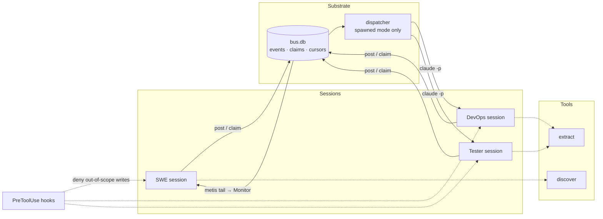

# Design

Three Claude sessions — **SWE**, **DevOps**, **Tester** — working autonomously on
the same goal, in separate terminals, communicating through a shared bus.

Each session reasons on its own and reacts to what the others do. Nothing drives
them. A small piece of boring infrastructure gives them a way to talk, a shared
memory, and enough safety rails that two of them cannot break the same thing at
the same time.

---

## 1. The core decision

**The orchestrator is a substrate, not a brain.**

Once you have three reasoning agents, adding a fourth component that decides what
happens next is a mistake in both directions. If it is dumb, it constrains three
capable agents to its own narrow model of the work. If it is smart, it duplicates
them, and you have four opinions and no tiebreaker.

But four problems are genuinely mechanical, and no agent can solve them from
inside its own context:

| Problem | Why an agent cannot solve it alone |
|---|---|
| Two agents deploy the same service | Neither can observe the other's intent in time |
| "What happened at 16:04?" | Each session's memory is its own context, and it compacts |
| Who goes first? | Symmetric agents deadlock symmetrically |
| When does this stop? | Nobody owns the iteration count |

So the shared component is a **switchboard, notice-board, and lock box**. It
records events, delivers them, grants leases, and enforces a stop condition. It
decides nothing about the work itself.

Everything above it is non-deterministic and smart. The substrate is
deterministic and dumb. That boundary is the design.

---

## 2. Principles

**Agents already have loops.** A Claude session reasons, acts, observes, and
retries. That is not something to build. What is missing is only communication,
shared truth, and safety.

**Evidence, not guesses.** Every inferred fact records what proved it. A finding
below the bar is reported with the reason it fell short, never silently acted on.

**Resources, not entities.** Concurrency is governed by named resources with
capacities, never "one agent per repo". Agent-per-repo does not survive many
repos or a second environment; resource leases do, unchanged.

**Deterministic where it can be.** Discovery, log extraction, lease arbitration,
and failure classification are ordinary code. Only judgement is a model call.

**Enforcement, not instruction.** Rules that must hold are enforced by hooks and
permissions, not requested in a prompt. A prompt is advisory; a `PreToolUse` hook
that exits non-zero is not.

**Design against the harder mode.** A cold, spawned agent has no memory. If the
system works for it, the attached case is strictly easier.

---

## 3. Architecture

The substrate is two things: a SQLite file and a CLI that reads and writes it.
The dispatcher exists only for spawned agents.

---

## 4. The three agents

Separated by **blast radius** — what they mutate, which lease they need, whether
it can be undone.

| Agent | Mutates | Holds | Reversible |
|---|---|---|---|
| **SWE** | source files | `worktree:<repo>@<ref>` | yes — `git reset` |
| **DevOps** | build output, then a live environment | `worktree:` for builds; `branch:` `cluster:` `schema:` for deploys | partially |
| **Tester** | data inside a running environment | `env:<name>` | **no** |

Hard boundaries, enforced by hooks rather than prompts:

- **SWE cannot deploy or push.** It has no path to an environment.
- **DevOps cannot edit source.** It cannot make a deploy pass by changing code.
- **Tester cannot edit or deploy.** It reports facts; it does not decide fault.
- **No agent may modify the test that caught its own failure.** Weakening an
  assertion is the cheapest way to turn a build green and it silently destroys
  the safety net. Repairing code and changing a test are separate, visible acts.

Discovery, log extraction, and review are **tools or modes**, not separate
agents. Any session can run discovery; any session can shrink a log; review is
something a session does to a diff.

---

## 5. Delivery modes

Same bus, same CLI, same roles, same hooks. Only how an agent is woken differs.

| | **attached** | **spawned** |
|---|---|---|
| Wake-up | agent *pulls*: `metis tail` under Monitor | dispatcher *pushes*: `claude -p` per event |
| Context | persists across iterations | cold every invocation |
| Idle cost | session sits open | zero |
| Lease on exit | held until released | released on exit; TTL is the backstop |
| Rehydration | remembers prior attempts | must read them from the bus |

Configured per agent, so they can be mixed. **Recommended default: SWE attached,
DevOps and Tester spawned.** SWE is the only role whose work is genuinely
iterative and benefits from remembering the last three attempts. Build, deploy,
and test are stateless — a cold process does them just as well, at a third of the
idle cost.

### Why spawned mode improves the design

A cold agent that cannot retrieve prior attempts will confidently retry a fix
that already failed twice. That forces `metis context` to be genuinely sufficient:
role, triggering event, current phase, prior attempts, last fault slice.

The test is simple — if a human could pick up the work from that output alone, a
cold agent can too. Designing to it removes a whole class of bugs where the
system only worked because a session happened to remember something.

---

## 6. How a session wakes up

A Claude session is turn-based; it does not spontaneously act. The wake-up is not
special machinery — it is a background process printing lines, and the harness
turning each line into a notification.

**Attached:** the session arms a Monitor on `metis tail --agent devops`. That
process polls the events table past its cursor and prints matching rows. Each
printed line arrives as a notification inside the session, re-invoking the model.

**Spawned:** the dispatcher does the same tailing, and instead of printing,
invokes `claude -p` with a prompt built from `metis context`.

Output must be flushed per line. Buffered output means notifications arrive in
clumps, or not at all.

### Durability beats a live socket

If DevOps is not running when SWE posts, nothing is lost — events are rows.
DevOps starts, reads its stored cursor, and catches up. The same property covers
crashes: a session dies mid-build holding a lease, the lease expires on its TTL,
the session restarts and resumes from its cursor.

A socket-based bus loses every message sent while a peer was down.

---

## 7. Safety

**Leases.** An agent may only act while holding every lock key its action
declares. Keys carry capacities, are acquired in sorted order to avoid deadlock,
and expire on a TTL so a crash cannot wedge a resource forever.

**Idempotent actuation.** Deploys carry a key derived from the artifact hash, so
a duplicate is a no-op rather than a second rollout.

**Termination.** Nobody in a peer network owns the stop condition, so the
substrate does: past `max_iterations`, `claim` stops granting and a `halted`
event is posted. The bus enforces stopping without deciding anything semantic.

**Livelock detection.** All agents waiting with no pending events is a deadlock
none of them can see. The bus can, and posts `stalled`.

**Write scoping.** `PreToolUse` hooks read the agent's role and reject writes
outside its allowed paths. This is where "DevOps cannot edit source" stops being
a request and becomes a refusal.

**Rollback is emitted, never executed.** The plan is written; a human runs it.

---

## 8. Decisions, and what was rejected

| Decision | Rejected alternative | Why |
|---|---|---|
| Substrate, not orchestrator | central scheduler assigning work items | wastes three reasoning engines running them as step executors |
| Three agents | nine personas (Surveyor, Critic, Integrator, Observer…) | those are tools and modes, not processes |
| CLI over Bash | MCP server | no server to build; the harness already provides the wake-up primitives |
| SQLite | append-only JSONL | needs indexed eligibility queries and lease transactions, not just a log |
| Resource leases | one agent per target | agent-per-target does not survive many repos or a second environment |
| Hooks for enforcement | prompt instructions | prompts are advisory; the rules that matter cannot be |
| Ledger | live socket / message queue | a peer that was down must be able to catch up |

The MCP trade-off is real and worth stating: with MCP, the tool surface *is* the
boundary. With Bash, an agent could bypass the bus. Enforcement therefore shifts
to hooks and per-role permissions, which is weaker in theory and adequate in
practice — provided the hooks are written in the same step as the bus, not after.

---

## 9. What exists today

| Component | Status |
|---|---|
| `resolve.py`, `scan.py` | **done** — local + git URL, pruning, workspaces, sibling repos |
| `registry.py` + 4 detectors | **done** — Java/Maven, Gradle, Node, Python; commands derived |
| `capabilities.py` + `capabilities.yaml` | **done** — 4 evidence tiers, confidence, secret redaction |
| `iac.py` | **done** — resources, IAM actions, load-balancer-polled paths |
| `deployment.py`, `testing.py`, `report.py` | **done** — deploy identifiers, test→target map, `discovered.yaml` |
| `probes/` + `java_spring.py` | **partial** — families, permission-bounded planning, Spring generator; validated on one target |
| `loop/extract.py` | **done** — Maven, pytest, JS, runtime fault slices |
| `loop/state.py` | **superseded** — single-process snapshot; replaced by the bus |
| `metis` + schema | **not built** |
| roles, hooks, permissions | **not built** |
| dispatcher | **not built** |

Discovery and extraction become **tools any agent calls**. They are the two
pieces that carry over unchanged.

Validated end to end on a four-service Java workspace: discovery reproduced a
hand-derived capability matrix from evidence alone, and the generated deep health
endpoint performed a real object-store round trip while leaving the
load-balancer-polled path untouched.

---

## 10. Build order

1. **`metis` + schema** — post, await, tail, claim/renew/release, state. Prove
   it with two terminals: exactly one wins a contested claim.
2. **`metis context`** — the command spawned mode lives or dies on.
3. **Roles + hooks + permissions** — write-scoping enforced before any agent runs
   unattended.
4. **Attached mode** — needs no new code beyond `metis tail`. SWE and DevOps in two
   terminals, one waking the other.
5. **Dispatcher** — tail, match `wake_on`, spawn, release on exit, debounce.
6. **Deploy path** — leases, idempotency keys, previous-reference capture,
   rollback plan emission.

Step 3 before step 4 is deliberate. An agent running unattended without write
scoping is the one configuration that can do real damage.
